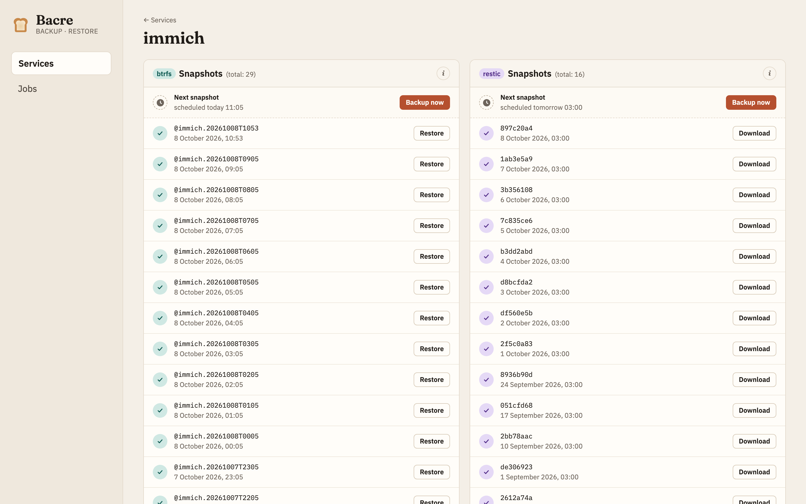

# Bacre: Simple Backups for Self-Hosters



## Summary

Bacre is a simple backup dashboard for self-hosters.

It puts a web interface on top of btrfs snapshots and restic repositories, and takes care of the scheduling and retention for you. Every service describes its own backups in a small `bacre.yaml` next to it, which Bacre discovers automatically. Bacre is a single binary that runs directly on your server.

Point Bacre at your services, and receive:

- btrfs snapshots, sent incrementally to other disks
- restic backups, to any repository restic supports
- schedules and retention rules per service
- lifecycle hooks for stopping services or dumping databases around a backup
- restores from any snapshot, straight from the browser
- ... and much more!

## Quickstart

```sh
curl -fsSL -o bacre https://github.com/butterhosting/bacre/releases/latest/download/bacre-linux-amd64
chmod +x bacre
echo 'server: { bind: 127.0.0.1, port: 3000 }' > config.yaml
sudo ./bacre config.yaml
```

## Documentation

Please visit [www.butterhost.ing/bacre](https://www.butterhost.ing/bacre) for the full documentation, covering deployment, configuring services, restores, tips, tricks and more.
